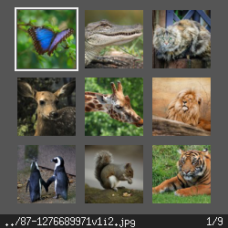
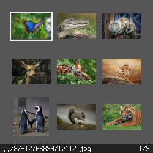
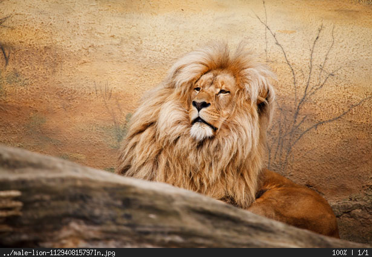
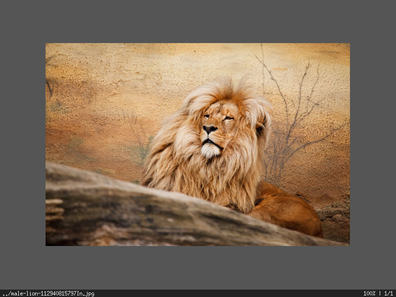
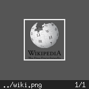
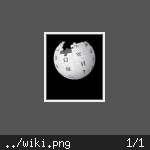

# Sxiv Patches
### sxiv-square-thumbnails.patch
  Makes the thumbnails square:  
  
### sxiv-window-fit-image.patch
  Makes the window fit the image when displaying single image:  
  

### sxiv-thumbnail-type-from-image.patch
  Makes sxiv derive the thumbnail type from the image
  so sxiv can support transparent thumbnails:  
  

### sxiv.rb
  Ruby script for finding optimal thumbnail size.  
  The thumbnail size is calculated so that when viewing thumbnails in
  full screen the empty space is minimal.

  The calculation uses the width and height of the display.  
  **If you are using the bottom bar you have to
  substract his height(by default the font size + 2px)
  from the height of the display.**

  The calculation can be done for windows too.
```
sxiv.rb -w <window-width> -h <window-height>
```

  For more information:
```
sxiv.rb --help
```

